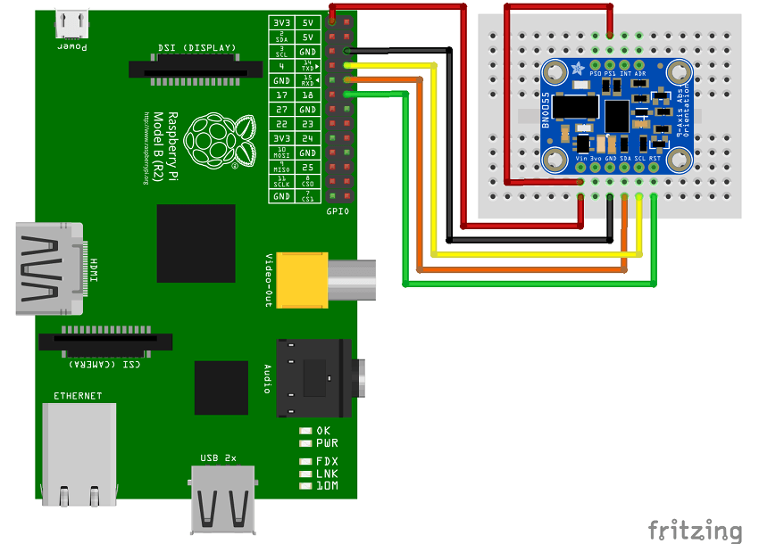

# Rotation Sensing Content Demo

This package shows how the
[BNO055 sensor](https://learn.adafruit.com/adafruit-bno055-absolute-orientation-sensor/overview)
from Adafruit can be used to build content that reacts to rotation changes. Right now it's a
simple video player that endlessly plays a single video and overlays a scaling _Hello World_
text. Of course more complicated integrations could be done. It's really only limited by
your imagination. Here's a small demo:

[](https://www.youtube.com/watch?v=w5aavTxRwmA)

## Hardware setup

You can see the required wiring in the following picture:



If you don't have a breadboard you can also connect the PS1 input to the other 3.3V
output pin on the Pi.

The [package service](https://info-beamer.com/doc/package-services) uses the
[BNO055.py](https://github.com/adafruit/Adafruit_Python_BNO055) module. A minor
modification has been made so it works with the info-beamer GPIO code in
[hosted.py](https://github.com/info-beamer/package-sdk/blob/master/hosted.py).

## info-beamer setup

You'll need info-beamer OS version 10 running on your device. Right now that's only
available in the _testing_ channel. You can easily upgrade your device on the device
page (Manage > Activate testing channel).

In addition you'll need to enable UART. For that create the file 
[config/userconfig.txt](https://info-beamer.com/doc/device-configuration#customraspberrypisettings)
on the SD card of your info-beamer device and add the following content:

```
enable_uart=1
dtoverlay=uart1
```

Once all that's done, you're ready to run this package: Import it (just click the import link
above) and create a setup. Set a video and then assign the setup to your device. After
a few seconds the background service should start running and keep the current rotation
updated.
